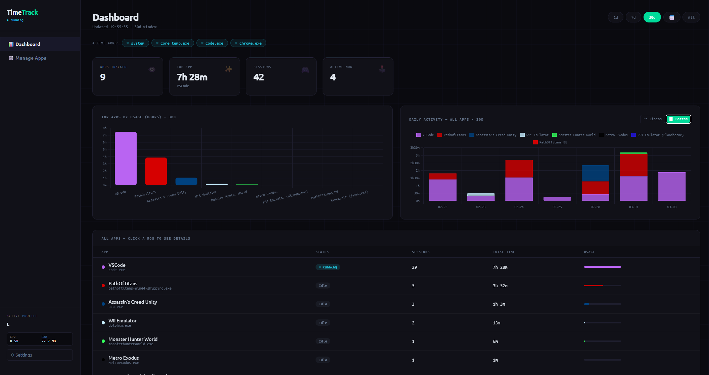
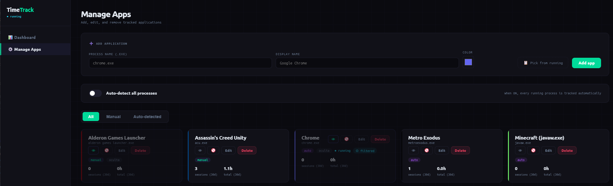

# TimeTrack

> **Local application usage tracker with a web dashboard.**
> Runs silently in the Windows system tray. No accounts, no cloud — all data stays on your machine.

The general idea of the project is to provide an application that starts with the system and, consuming minimal resources, continuously monitors the execution time of apps (processes) on the system.


---

## Features

- **Automatic process tracking** — monitors every running application every 3 seconds
- **Game auto-detection** — identifies games via Steam / Epic / GOG / Ubisoft paths, Windows Game Mode registry, NVIDIA DRS driver profiles, and user-defined custom directories
- **Web dashboard** — bar charts, daily activity (line or stacked), session timeline
- **Multiple profiles** — separate tracking for Work, Gaming, Personal, etc.
- **Session management** — edit, delete, clear date ranges, or move sessions between apps
- **System tray icon** — minimal footprint; right-click for quick actions and game prompts
- **No internet required** — 100% local, SQLite database

---

## Showcase

### Screenshots

| Dashboard |
|-----------|
|  |

| App Management |
|----------------|
|  |

### Demo

[]


---

## Installation

### Option A — Download the pre-built release *(easiest)*

1. Download **`TimeTrack.zip`** from the [Releases](../../releases/latest) page
2. Extract anywhere (e.g. `C:\TimeTrack\`)
3. Double-click **`TimeTrack.exe`**

The app starts in the system tray and opens the dashboard in your browser automatically.

---

### Option B — Run from source

**Requirements:** Python 3.11 or higher ([python.org](https://www.python.org/downloads/))

```bat
:: 1. Clone or download this repository, then:
setup.bat
```

`setup.bat` creates a virtual environment, installs all dependencies, and adds a desktop shortcut.

**To launch:**

| Method | Command |
|--------|---------|
| Silent (recommended) | Double-click `TimeTrack-silent.vbs` |
| With console (debug) | Double-click `TimeTrack.bat` |
| Manual | `.venv\Scripts\pythonw.exe tray.py` |

---

### Option C — Build your own .exe

```bat
:: After completing Option B:
build.bat
```

This installs PyInstaller (if needed), compiles the project, and produces:
- `dist\TimeTrack\TimeTrack.exe` — the standalone executable
- `dist\TimeTrack.zip` — ready to attach to a GitHub Release

---

## Usage

### Dashboard (`http://127.0.0.1:31337`)

Opens automatically when TimeTrack starts. Double-click the tray icon to reopen it.

| Control | Action |
|---------|--------|
| **1D / 7D / 30D / All** | Change the time window for all charts and the app list |
| **📅 Calendar** | Pick a custom date range |
| **Click chart card** | Expand the card to full width |
| **Click a data point** | Open the 24-hour session timeline for that day |
| **〜 Lines / ▊ Bars** | Toggle the daily activity chart between line and stacked bar mode |
| **Click an app row** | Open the detail panel with session history and per-day charts |

### App Management (`/apps-page`)

Navigate via the **Apps** link in the sidebar.

- **Add manually** — type the `.exe` filename, or click **Pick from running** to choose from active processes
- **Edit** — change display name, color, or tracking options per app
- **Hide** — toggle the eye icon to hide an app from the dashboard without deleting data
- **Sessions** — edit individual sessions inline, delete them, clear a date range, or move them to another app

---

## Auto-start with Windows

**Method 1 — Prompted during setup**
Answer `s` (sí) when `setup.bat` asks *"¿Añadir al inicio de Windows ahora?"*

**Method 2 — Manual**
1. Press `Win + R`, type `shell:startup`, press Enter
2. Copy **`TimeTrack-silent.vbs`** (source install) or **`TimeTrack.exe`** (release) into that folder

**Method 3 — Desktop shortcut**
`setup.bat` creates `TimeTrack.lnk` on the Desktop. You can also copy that shortcut to the startup folder.

---

## Settings

Click the **⚙** gear icon in the sidebar, then open the **Tracker** tab.

### Detection methods

TimeTrack uses up to 5 layers to decide whether an unknown executable is a game:

| Priority | Method | How it works |
|----------|--------|--------------|
| 1 | **Launcher paths** | Built-in patterns: Steam, Epic Games, GOG, Ubisoft, EA, Xbox Game Pass… |
| 2 | **Custom paths** | Directories you add (e.g. `M:\MyGames\`) — any `.exe` inside counts as a game |
| 3 | **Windows Game Mode** | Apps registered under `HKCU\System\GameConfigStore` |
| 4 | **NVIDIA DRS profiles** | Executables referenced in NVIDIA driver profile files |
| 5 | **Heuristic** | Path contains game-related keywords (`games`, `steam`, `epic`, …) |

Each layer can be enabled or disabled individually.

### Adding apps

**Automatically (recommended for games)**
1. Enable **Auto-detect** in Settings → Tracker
2. Launch a game — a Windows toast notification (or tray balloon) appears asking whether to track it
3. Confirm with ✓ to start recording, ✗ to skip once, or *Don't ask again* to permanently ignore

**Manually**
1. Go to **Manage Apps** (`/apps-page`)
2. Click **Add app**, type the `.exe` name, or use **Pick from running**

### Notification mode

| Mode | Description |
|------|-------------|
| **Toast** | Windows 11-style notification with action buttons (requires `win11toast`) |
| **Tray** | Balloon tip in the system tray — click the tray icon to respond via its menu |

---

## Tech Stack

| Layer | Technology |
|-------|------------|
| Backend | Python 3.11+, FastAPI, uvicorn |
| Database | SQLite (WAL mode, thread-local connections) |
| Process monitor | psutil (3-second poll) |
| System tray | pystray + Pillow |
| Notifications | win11toast (optional, graceful fallback) |
| Frontend | Vanilla JS, Chart.js 4 |

---

## File Structure

```
TimeTrack/
├── core/
│   ├── database.py        SQLite layer (WAL mode, thread-local connections)
│   ├── tracker.py         psutil process monitor (3-second poll)
│   ├── game_detection.py  Multi-layer game heuristic
│   └── notifications.py   Toast / tray balloon notifications
├── api/
│   └── routes.py          All REST endpoints (/api prefix)
├── ui/
│   ├── index.html         Dashboard
│   └── apps.html          App management
├── images/                Icons and assets
├── screenshots/           README screenshots (add yours here)
├── main.py                FastAPI app + server (port 31337)
├── tray.py                Entry point — system tray + server launcher
├── requirements.txt       Python dependencies
├── setup.bat              First-time setup (venv + shortcuts)
├── build.bat              Build standalone .exe with PyInstaller
├── TimeTrack.spec         PyInstaller configuration
├── TimeTrack.bat          Launch with console (debug mode)
├── TimeTrack-silent.vbs   Launch without console (normal use)
└── export_github.bat      Export a clean copy to another directory
```

---

## License
GPL — free to use, modify, and distribute.
